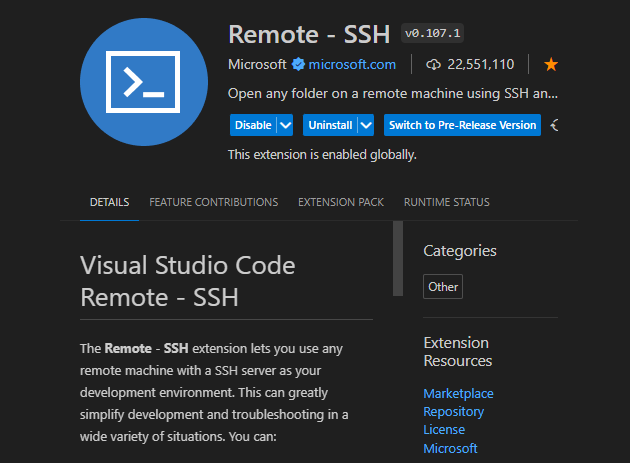

# Preparação de Ambiente
### Vamos preparar o ambiente para desnvolvimento de aplicações
 
#### Neste ambiente iremos instalar e configurar os seguintes recursos:
 - Máquina Virtual(Virtualbox)
 -Distribuição Linux (Ubuntu serve)
 Nasm
 - Compilador da linguagem C
 - Configurar o ip e a porta de comunicação entre a máquina real e a virtual
 - Configurar o acesso via SSH entre o VScode e o ServidorLinux
 -Instalar as extensões: Material Icon, Nasm, SSH e Linguagem C/C++
 
 
### Máquina Virtual (Virtualbox)

 
Máquina Virtual é uma ferramenta que permite a criação de novos "computadores" e a Instalação de sistemas operacinais, para estudos ou trabalho.
 
Para o nosso estudo iremos usar o Virtualbox, da Oracle.
Para instalar, basta fazer download no link a seguir:
<a href="https://www.virtualbox.org/wiki/Downloads" target= "_blank">Virtualbox</a>
 
##### Criando a Máquina virtual para nosso estudo
 
  - Configuração:
  + Nome da máquina: Servidor
  + Memória: 4 GB
  + Processador: 2
  + Capacidade: 100 GB
  + Porta do host: 127.0.0.1
  + Porta do convidado: 10.0.2.15
 
  - Tela inicial de Configuração
 

 
 - Tela inicial do Hardware
 

 
 - Tela do Disco rígido
 

 
 - Tela de configuração geral
 

 
 - Tela de Configuração
 

 
 - Tela de IP
 

 
#### Distribuição Ubuntu server
- Para o nosso estudo usaremos uma distribuição Linux para servidores chamada Ubuntu, acompanhe o processo de instalação a seguir:
 
Link do Download do Ubuntu:
<a href="https://ubuntu.com/download/server">
 https://ubuntu.com/download/server
 
 

 
 
- Tela de inicio de instalação
 

 
- Tela de idiomas (português-Brasil)
 

 
- Tipo de Teclado
 

 
 
- Tipo de instalação
 

 
- IP (Rede)
 

 
- Proxy da rede
 

 
- Tela de pacotes de instalação
 

 
- Instalação do SSH
 

 
- Configuração do layout de do disco rígido
 

 
- Reboot final do sistema
 

 
tem menu de contexto

reinicie o seu servidor usando o comando abaixo:

´´´
reboot
´´´

#### Instalação do compilador NASM
O compilador do NASM é uma ferramente que nos permite programar em Assembly. Assim é possível criar programas que manipulam dados que estão nos registradores do processador.

Para instalar o NASM no Ubunto, usamos o comando:
´´´
sudo apt install nasm -y
´´´
#### Instalação do compilador de Linguagem C

Em Linux, o compilador Linguagem C é o GCC, Ele é uma ferramenta importante para o desenvolvimento de programas em C.

Para instalar use o comando:
´´´
sudo apt install gcc -y
´´´

#### Conexão Servidor e VSCode via SSH

Precisamos instalar uma extensão no VSCode para acessar o nosso servidor de forma remota.

Configuração do acesso remoto.

